# 2-D Ising Model via Single-Spin Flip Metropolis MC

We implement a Monte Carlo simulation of the two-dimensional Ising model using the Metropolis algorithm. The 2D Ising model is built on a square lattice of size $L \times L$ with each site $i$ carrying a spin $s_i = \pm 1$. Its Hamiltonian is

$$
H = -J\sum_{\langle i,j \rangle} s_i s_j,
$$

where the sum runs over all nearest-neighbor pairs and periodic boundary conditions are imposed. The model is simulated via a single-spin flip Metropolis algorithm: a random spin is selected and flipped with probability

```math
$$
\min\left\{1,\, e^{-\Delta E/T}\right\},
$$
```
with the energy change given by

$$
\Delta E = 2J\, s_i \sum_{j\in \mathrm{nn}(i)} s_j.
$$

Our work involved calculating key observables—energy ($E$), magnetization ($M$), susceptibility ($\chi$), and heat capacity ($C_V$)—as functions of temperature ($T$), and studying finite-size effects by varying the lattice size ($L$). We optimized the simulation by using a lookup table to avoid repeated exponential evaluations, benchmarked its performance against the non-optimized version, and analyzed the time series of magnetization below $T_c$ to illustrate finite-size induced sign-flips. 


<p align="center">
  
  <br>
  <em>Animation of the 2D Ising model dynamics at various temperatures. At temperatures lower than Tc, domains are very stable and fluctuations are minimal. Near Tc, critical fluctuations and large domain rearrangements occur.  At higher temperatures, the system is disordered, with rapid spin fluctuations and no long-range order. </em>
</p>


## Table of Contents

- [Thermodynamic Observables at Varying $T$](#thermodynamic-observables-at-varying-t)
- [$T_c$ Estimation](#t_c-estimation)
- [Results' Dependence on System Size](#results-dependence-on-system-size)
- [Saving Computation Time Using a Predefined Dictionary](#saving-computation-time-using-a-predefined-dictionary)
- [Dependence of $M$ on the Simulation Time at $T < T_c$](#dependence-of-m-on-the-simulation-time-at-t--tc)


## Thermodynamic Observables at Varying $T$ 
- `v2.0-ising2d.py`

Theoretically, the following behavior is expected for each therodynamic observable in the Ising model:

- **Magnetization:** For low temperatures (high $\beta$), the absolute magnetization per spin is high, reflecting spontaneous symmetry breaking. As temperature increases and approaches the critical temperature ($T_c$), the magnetization decreases, becoming nearly zero in the paramagnetic phase. In a finite system, the transition is smooth, while in the thermodynamic limit it becomes sharp.

- **Energy:** The energy per spin increases with temperature. At low temperatures, the energy is low (more ordered state) and it increases as thermal fluctuations grow with temperature. An inflection point near $T_c$ is often observed.

- **Magnetic Susceptibility:** The susceptibility is expected to exhibit a peak near the critical temperature due to large fluctuations in magnetization. This peak becomes more pronounced with increasing system size.

- **Heat Capacity:** Similarly, the heat capacity shows a peak around $T_c$, indicative of critical fluctuations. In the infinite system limit, the specific heat diverges logarithmically at $T_c$.


Thus, when plotting these quantities as functions of inverse temperature $\beta$ (or temperature $T$), one observes: 
- High magnetization and low energy at low $T$ (high $\beta$)
- A critical region near $T_c \approx 2.269$ where susceptibility and heat capacity peak
- Low magnetization with higher energy in the high-temperature phase (low $\beta$).

We used error bars indicating the standard deviations of the measured quantities at each temperature point. These are computed from the fluctuations in the Monte Carlo samples. In the context of the Ising model, we expect increased fluctuations near phase transitions, where critical phenomena cause a broader spread of values.

For each observable a value of the inverse temperature is inferred from the data. For **magnetization** and **energy** the inferred value is taken as the beta where the absolute value of the numerical derivative (with respect to beta) is maximal. For **susceptibility** and **heat capacity** the maximum value directly indicates the transition. 

### Simulation Parameters

<div align="center">

| Parameter                         | Value                                              |
|-----------------------------------|----------------------------------------------------|
| Lattice linear size               | $L = 10$                                           |
| Total number of spins             | $N = L \times L = 100$                             |
| Coupling constant                 | $J = 1$                                            |
| Thermalization steps              | $N_{\text{therm}} = 10^6$                            |
| Number of measurements            | $N_{\text{sample}} = 5000$                           |
| Moves between measurements        | $N_{\text{subsweep}} = 10 \times N$                  |
| Beta range                        | $\beta \in [0.1,\, 0.8]$                            |

</div>


### Figures

<div align="center">
  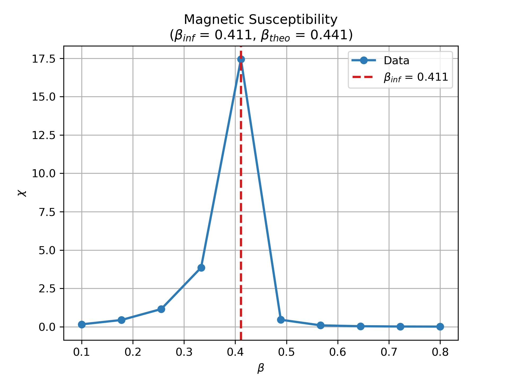
  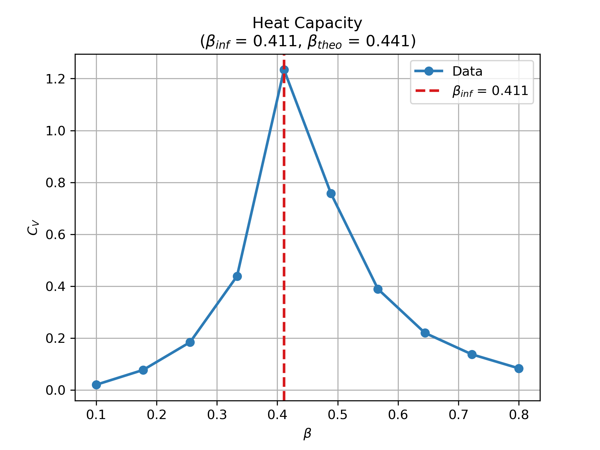
</div>

<div align="center">
  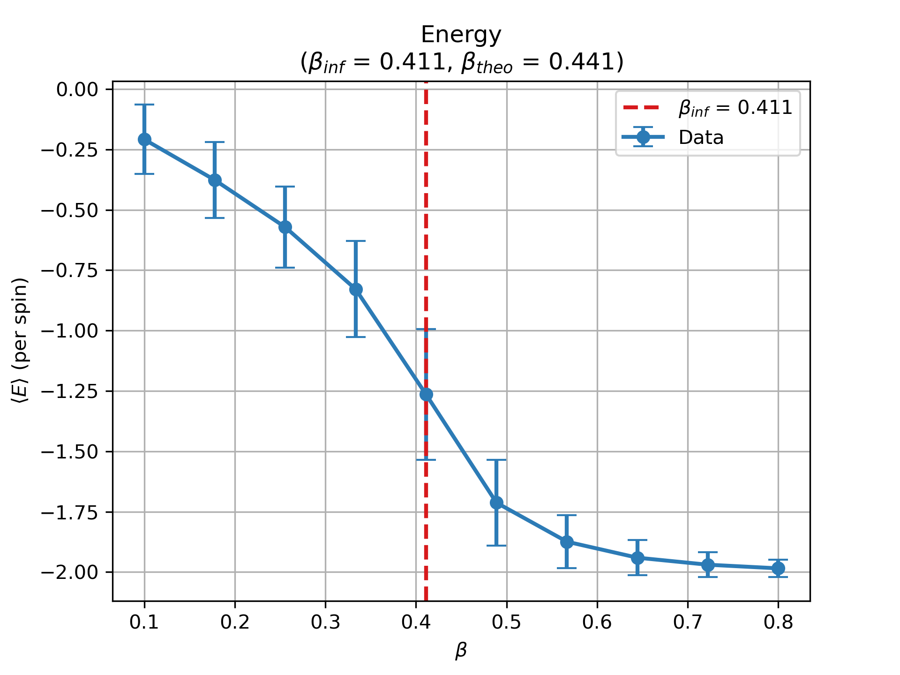
  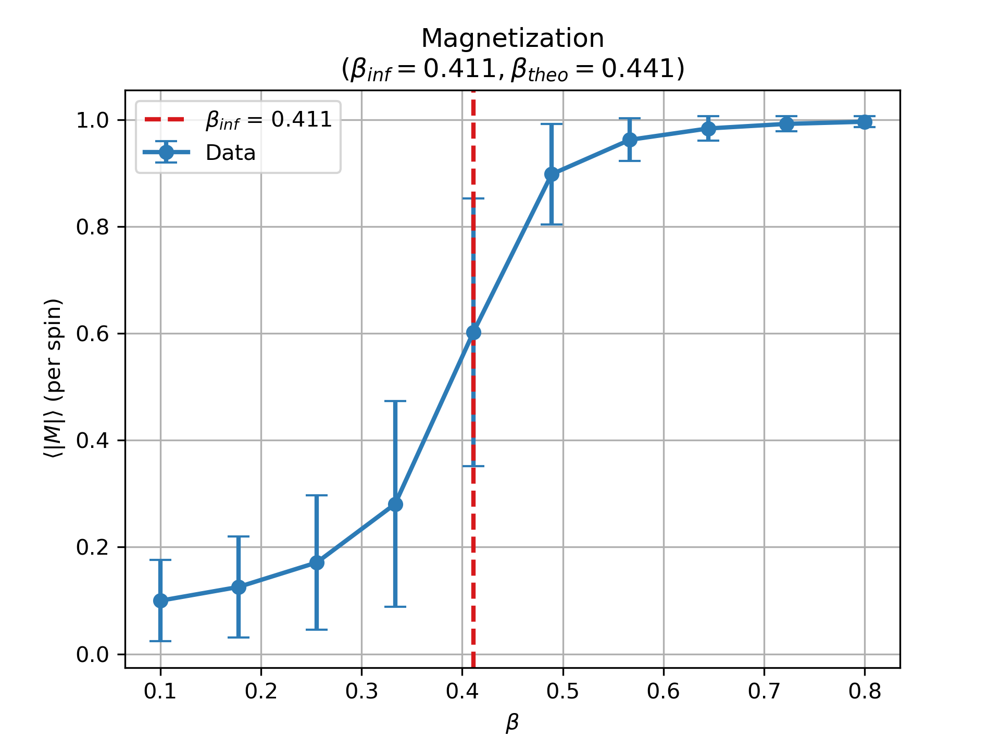
</div>


## $T_c$ Estimation

The theoretical critical temperature is given by  
$$
T_c = \frac{1}{\beta_{theo}},
$$  
so with $\beta_{theo} \approx 0.441$, we have  
$$
T_c \approx \frac{1}{0.441} \approx 2.269.
$$ 

Our inferred value is $\beta_{inf} \approx 0.411$, which corresponds to  
$$
T_{c,\,inf} \approx \frac{1}{0.411} \approx 2.43.
$$  

The relative error in temperature is then  
$$
\text{Error} = \frac{|T_{c,\,inf} - T_c|}{T_c} \approx \frac{|2.43 - 2.269|}{2.269} \approx 7\%.
$$

Improving the results can be achieved by increasing the number of thermalization steps and measurement samples, and by optimizing the number of subsweeps between measurements.


## Results' Dependence on System Size 
- `v2.0-multi_size_simulation.py`

In this section, we reduce the number of measurements $N_{\text{sample}}$ to $1000$ and Thermalization steps $N_{\text{therm}}$ to $10^4$  for convenience. Plots generated aim to provide insight into how finite-size effects influence the observed phase transition and allow for a comparison with theoretical expectations.

<div align="center">
  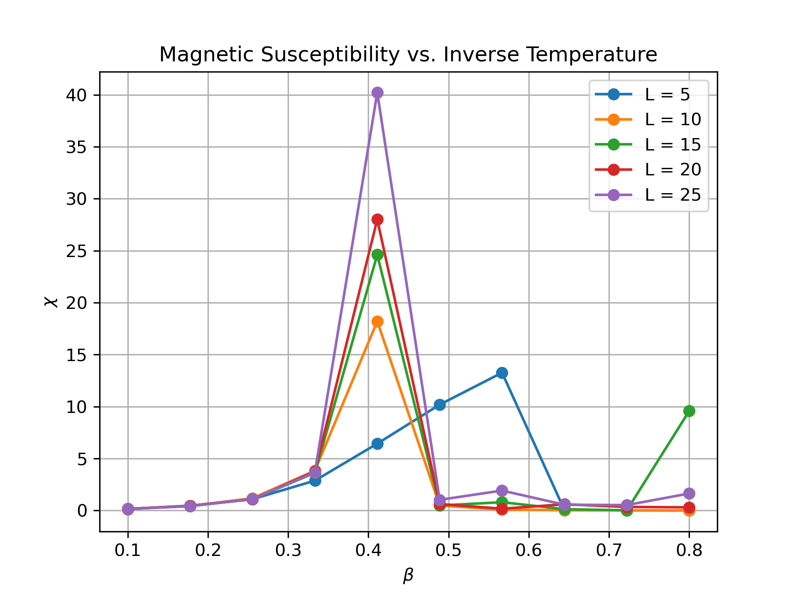
  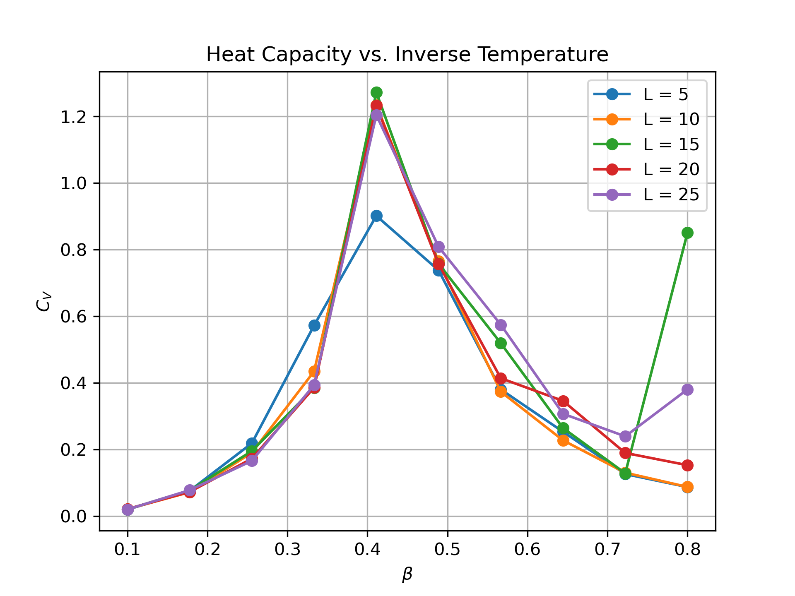
</div>

<div align="center">
  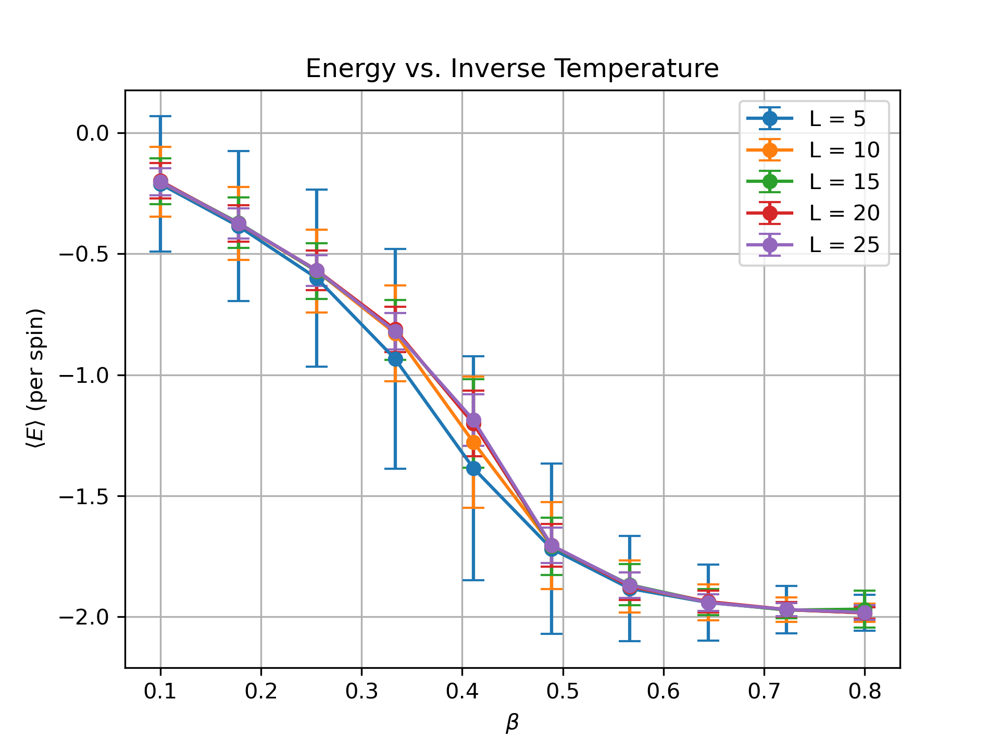
  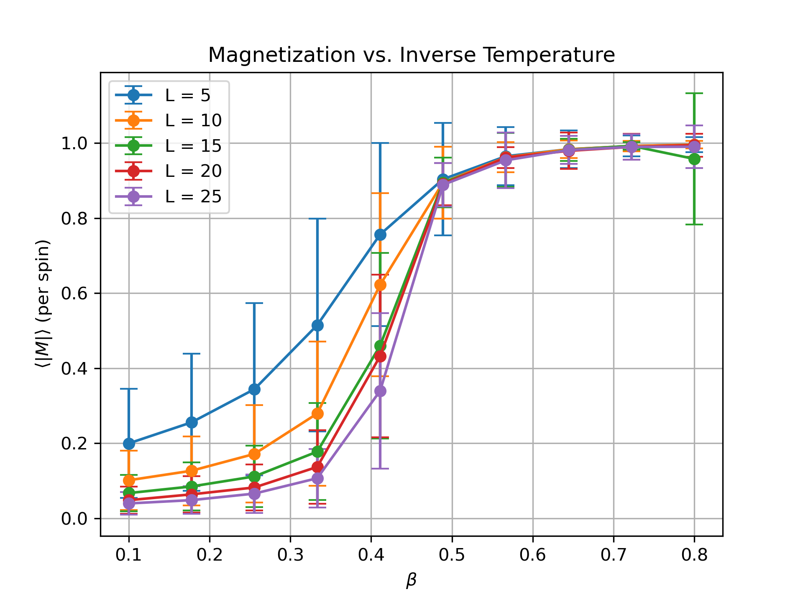
</div>

For small systems, we expect finite-size effects to strongly round the phase transition. In such cases:

- The average magnetization per spin, $\langle |M| \rangle$, is subject to significant fluctuations, and the system may frequently flip its overall magnetization sign, leading to a broad transition region.
- The energy per spin changes smoothly with temperature, and any inflection in its curve is less pronounced.
- The magnetic susceptibility, $\chi$, and heat capacity, $C_V$ exhibit broad, lower peaks near the critical temperature. The maximum values are suppressed due to finite-size rounding, and their locations (in terms of $\beta$) can be shifted relative to the true critical point.

As the system size $L$ increases:

- Fluctuations become relatively smaller (when normalized per spin), and the order parameter $\langle |M| \rangle$ becomes more stable, leading to a sharper, more well-defined phase transition.
- The inflection in the energy curve becomes more evident.
- The peaks in $\chi$ and $C_V$ become higher and narrower, converging towards the divergences expected in the thermodynamic limit.
- Finite-size scaling theory predicts that the peak values scale as power laws with $L$, and the position of the peaks will shift, approaching the theoretical critical inverse temperature $\beta_{theo}$ as $L$ increases.


<div align="center">
  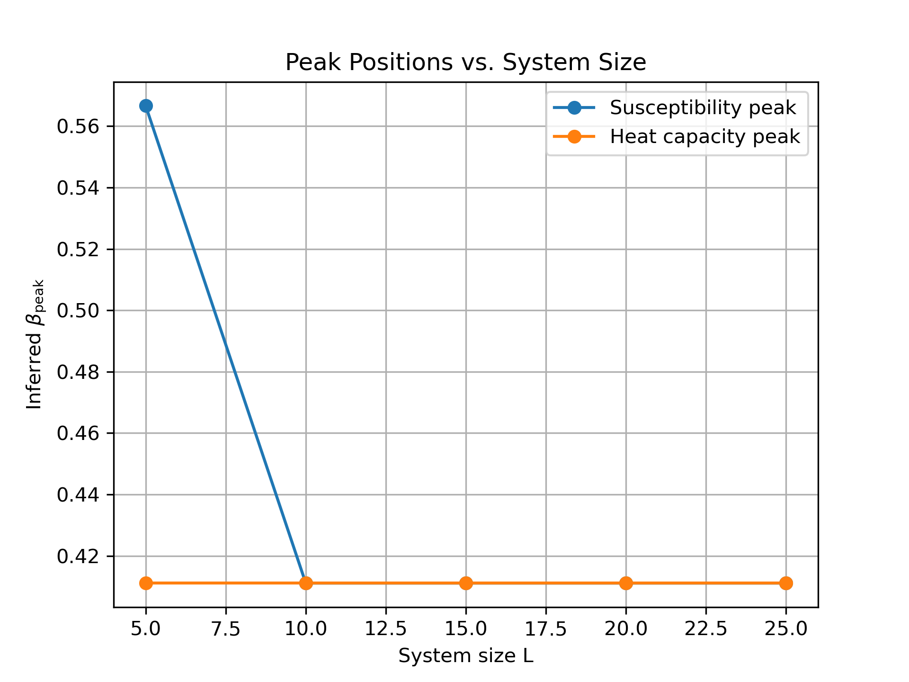
  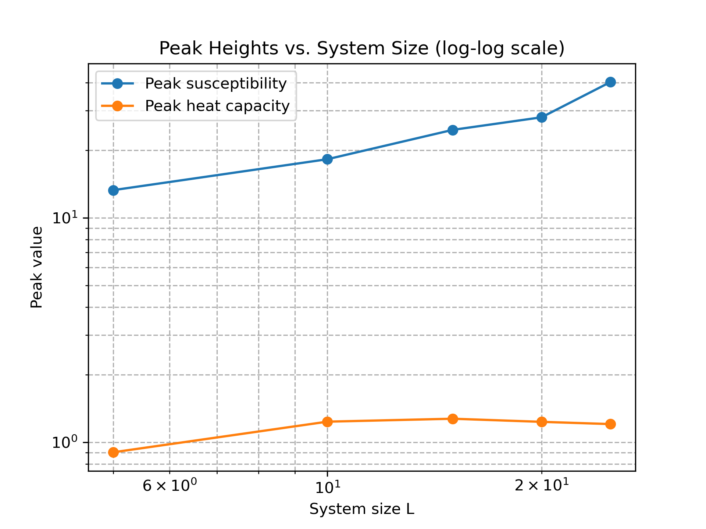
</div>


For the smallest system ($L=5$), the inferred inverse temperature for the susceptibility peak is at $\beta_{\text{peak}}^{\chi} \approx 0.567$, which is notably further from the expected value than for larger systems, where $\beta_{\text{peak}}^{\chi}$ converges to approximately $0.411$ for $L \ge 10$. The peak susceptibility $\chi$ increases with system size (from about $13.27$ at $L=5$ to $40.23$ at $L=25$), indicating stronger critical fluctuations as $L$ increases. In contrast, the peak heat capacity $C_V$ remains relatively constant (around $1.2$ for $L \ge 10$) with minor fluctuations. These results illustrate that as the system size grows, the estimates for the critical inverse temperature stabilize and the amplitude of fluctuations in susceptibility increases, consistent with finite-size scaling theory and the approach toward the thermodynamic limit.


## Saving Computation Time Using a Predefined Dictionary
- `lookup-ising2d.py`
- `lookup-multi_size_simulation.py`
- `lookup-micro-benchmarking.py`

We updated the scripts accordingly such that, for each $\beta$ (inside the outer loop), a dictionary called `lookup` is built. For each possible $\Delta E$ in $[-8, -4, 0, 4, 8]$:
   - If $\Delta E \le 0$, the acceptance probability is $1$.
   - If $\Delta E > 0$, the probability is computed as $\exp(-b \, \Delta E)$.
   
The `move` function now accepts an additional parameter `lookup`. If provided, the acceptance probability $R$ is obtained by looking up $\Delta E$ in the dictionary, saving computation time by not re-evaluating the exponential function. Both the thermalization and measurement loops call `move` with the precomputed `lookup` for the current $\beta$.

Additionally, we design the a simple benchmarking script that  measures the time required to call the move function repeatedly with and without the lookup table and then plots a bar chart to compare them. This micro‐benchmark focuses only on the move function, and an arbitrary $\beta$ value is chosen for testing. 

Using $L=10$ and $\beta = 0.5$, and running for $500,000$ iterations: 
   
```
Time with lookup: 3.1099 s over 500000 iterations
Time without lookup: 4.3368 s over 500000 iterations
```

<div align="center">
  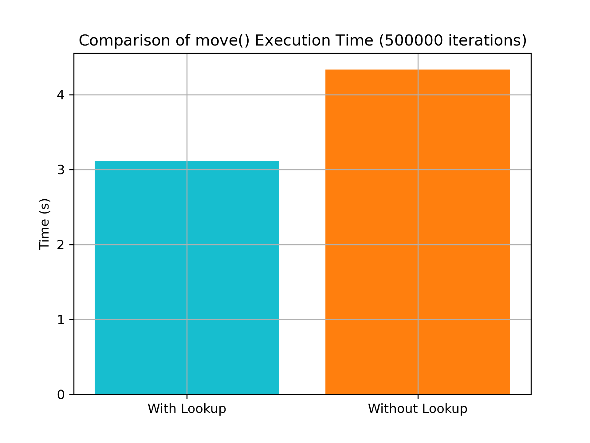
</div> 


## Dependence of $M$ on the simulation time at a temperature $T < T_c$ 

- `magnetization-timeseries.py` 

For this task we use the script `magnetization-timeseries.py`, which simulates the 2‑d Ising model for a small system at a temperature below $T_c$ (for instance, $T=2.0$ with $\beta=0.5$, which is below $T_c \approx 2.269$). After a thermalization period, the script records the total magnetization $M$ after every sweep (one sweep equals $L\times L$ spin updates). 


The script is designed such that the lattice size $L$ can be specified via terminal. For instance, for $L = 20$, we can run:

```
python3 magnetization-timeseries.py --L 20
```

This will generate a plot saved in the folder `task-5/` with the lattice size indicated in the file name. The default value is set as $L=10$.

<div align="center">
  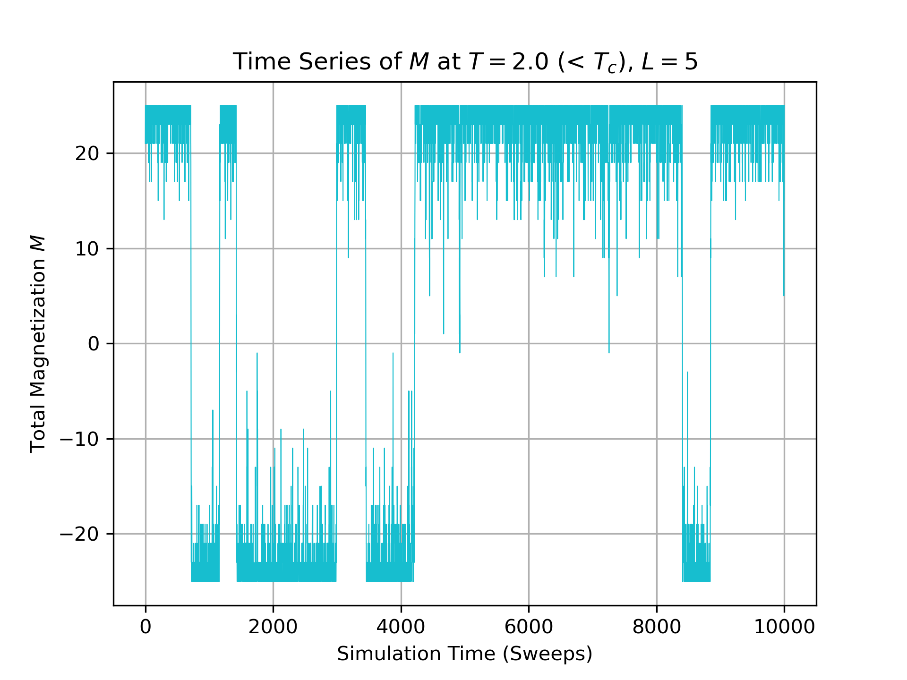
  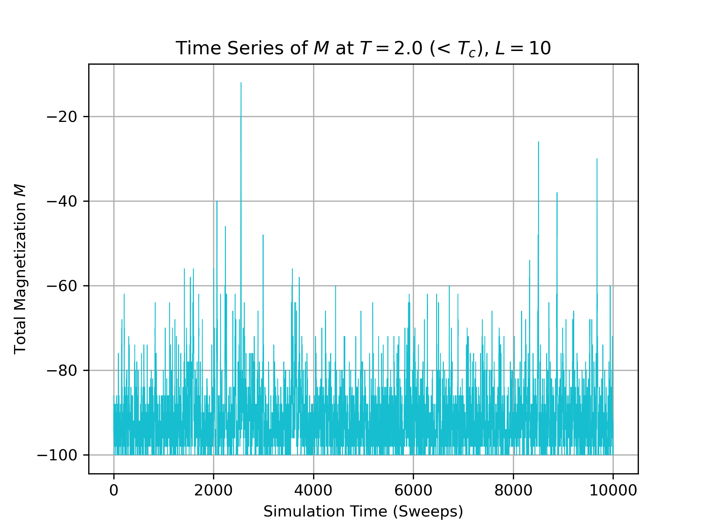
</div>


### Discussion
For a temperature $T < T_c$, the qualitative behavior in the magnetization time series is expected to differ depending on the system size:

- **Small $L$:**  
  Finite-size fluctuations dominate. The time series of the total magnetization $M$ will exhibit large relative fluctuations and frequent sign flips. In other words, the system may transiently switch between positive and negative magnetization because the free energy barrier separating the two symmetry-related states is relatively small for a small number of spins.

- **Large $L$:**  
  As the system size increases, the free energy barrier between the two ordered phases grows, so the system becomes more stable in one of the two symmetry-broken states. Consequently, the magnetization will tend to remain in one sign (positive or negative) for much longer periods with relatively smaller fluctuations (when scaled by the system size). In other words, the time series will show a more persistent magnetization state with fewer sign flips.


In general, these differences illustrate finite-size effects in the 2D Ising model: small systems are more susceptible to fluctuations and reversals, while large systems exhibit robust spontaneous symmetry breaking at temperatures below $T_c$.
